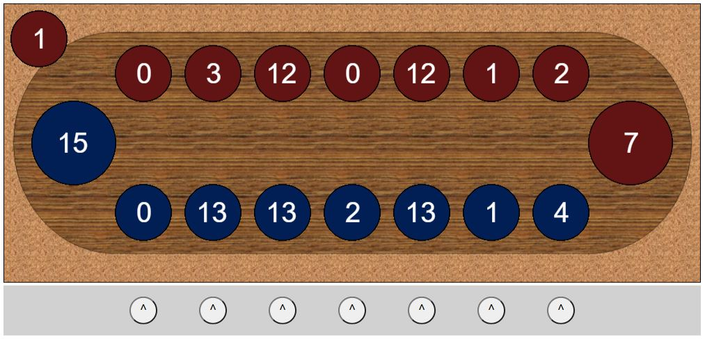

# GAME DAKON

_Game tradisional di Indonesia. Game ini dibuat menggunakan pure HTML, CSS, dan JS._

## Apa itu dakon

Dakon/Congklak adalah suatu permainan tradisional yang dikenal dengan berbagai macam nama di seluruh Indonesia. Biasanya dalam permainan, sejenis cangkang kerang digunakan sebagai biji congklak dan jika tidak ada, kadang kala digunakan juga biji-bijian dari tumbuh-tumbuhan dan batu-batu kecil.

## Cara bermain

Permainan congklak dilakukan oleh dua orang. Dalam permainan mereka menggunakan papan yang dinamakan papan congklak dan 98 (14 x 7) buah biji yang dinamakan biji congklak atau buah congklak. Umumnya papan congklak terbuat dari kayu dan plastik, sedangkan bijinya terbuat dari cangkang kerang, biji-bijian, batu-batuan, kelereng atau plastik. Pada papan congklak terdapat 16 buah lubang yang terdiri atas 14 lubang kecil yang saling berhadapan dan 2 lubang besar di kedua sisinya. Setiap 7 lubang kecil di sisi pemain dan lubang besar di sisi kananya dianggap sebagai milik sang pemain.

Pada awal permainan setiap lubang kecil diisi dengan tujuh buah biji. Dua orang pemain yang berhadapan, salah seorang yang memulai dapat memilih lubang yang akan diambil dan meletakkan satu ke lubang di sebelah kanannya dan seterusnya berlawanan arah jarum jam. Bila biji habis di lubang kecil yang berisi biji lainnya, ia dapat mengambil biji-biji tersebut dan melanjutkan mengisi, bila habis di lubang besar miliknya maka ia dapat melanjutkan dengan memilih lubang kecil di sisinya. Bila habis di lubang kecil di sisinya maka ia berhenti dan mengambil seluruh biji di sisi yang berhadapan. Tetapi bila berhenti di lubang kosong di sisi lawan maka ia berhenti dan tidak mendapatkan apa-apa.

Permainan dianggap selesai bila sudah tidak ada biji lagi yang dapat diambil (seluruh biji ada di lubang besar kedua pemain). Pemenangnya adalah yang mendapatkan biji terbanyak.

Ya begitu, btw ini lawan/bot nya ngerandom.

## PROGRESS (100%)

Silahkan bermain. kalo ada bug bilang..